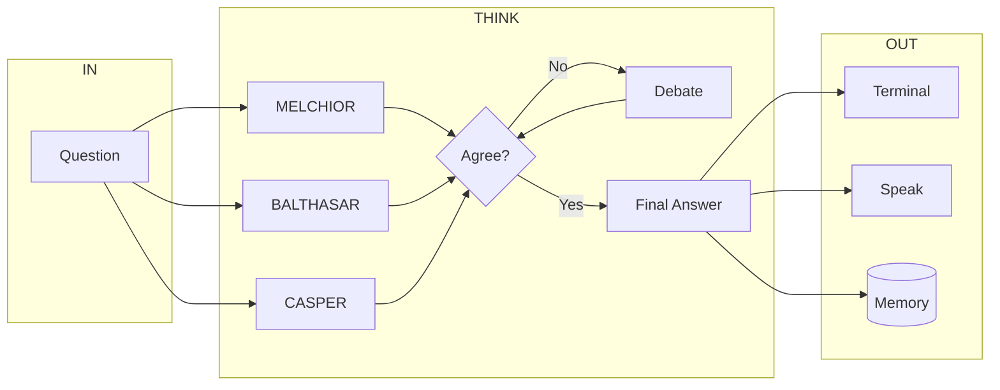
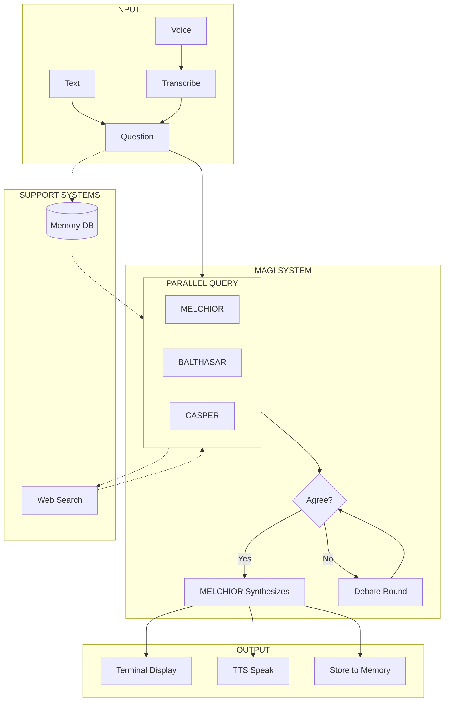
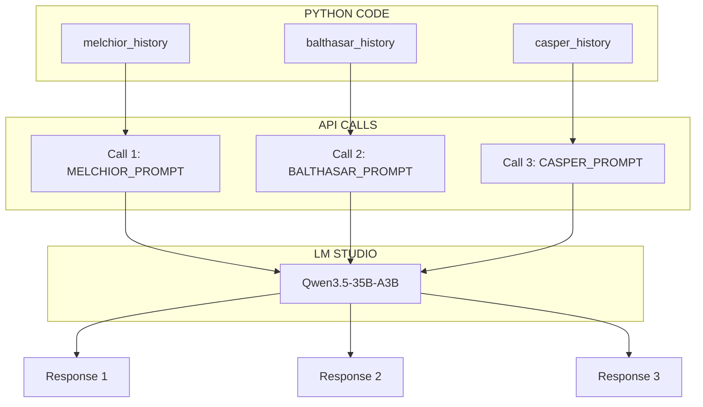
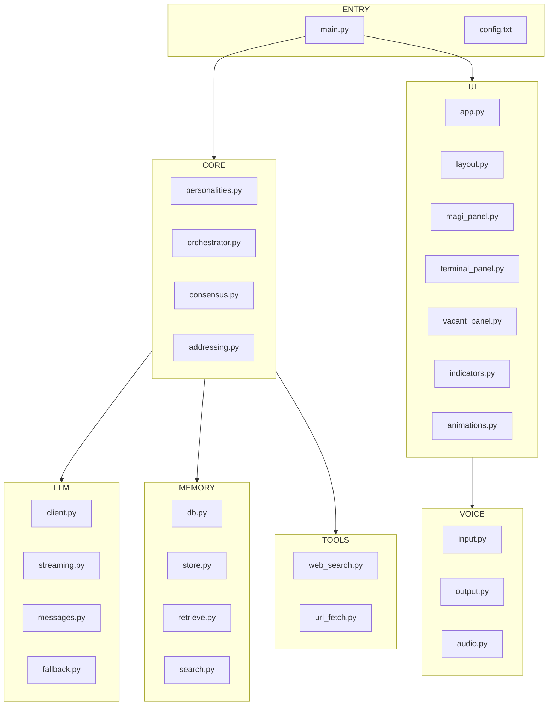
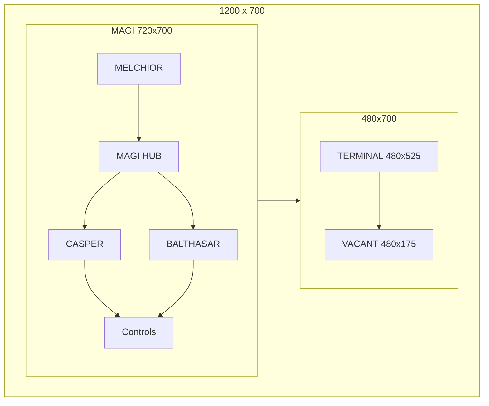

# MAGI SYSTEM DIAGRAMS

All system diagrams in one file. Each chart shows one concept.

---

## DIAGRAM 1: MAIN FLOW (SIMPLE)

Question goes in. Three AIs think. Answer comes out.

---

## DIAGRAM 2: MAIN FLOW (DETAILED)

Full system with voice input, memory retrieval, tool use.

---

## DIAGRAM 3: LLM ARCHITECTURE

One model loaded. Three separate API calls. No cross-contamination.

---

## DIAGRAM 4: FILE STRUCTURE

Modular design. Like with like. Each box is a folder.

---

## DIAGRAM 5: GUI LAYOUT

1200x700 fixed window. MAGI left (60%). Terminal and Vacant stacked right.

---

## QUICK REFERENCE

| Diagram | Purpose |
|---------|---------|
| 1. Main Flow Simple | Overview of question-to-answer flow |
| 2. Main Flow Detailed | Full system with all components |
| 3. LLM Architecture | How one model serves three personalities |
| 4. File Structure | Modular code organization |
| 5. GUI Layout | Window layout and proportions |
